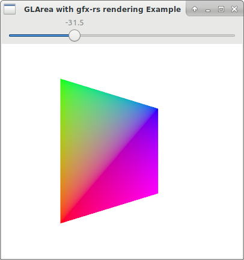

# gfx-gtk

Simple bridge library to render into a gtk-rs `GLArea` using the Gfx (pre-ll) library.

Uses [epoxy] for Gl loading, and as such it doesn't require a Gl window/loading management such as `glutin` or `winit`


 Here's a short broken-down list to get the integration up and running:

### Add the Cargo dependencies

```
[dependencies]
gfx_gtk = "0.3"
```

### Import crate and packages

```rust
extern crate gfx_gtk;

use gfx_gtk::formats;
use gfx_gtk::GlRenderContext;
```

### Choose some render formats and AA mode

```rust
const MSAA: gfx::texture::AaMode = formats::MSAA_4X;
type RenderColorFormat = formats::DefaultRenderColorFormat;
type RenderDepthFormat = formats::DefaultRenderDepthFormat;
```

### Write a render callback

You need to implement [GlRenderCallback] and [GlPostprocessCallback] traits (the latter
can be made to use the default implementation)

```rust
struct SimpleRenderCallback {
	...
}

impl gfx_gtk::GlRenderCallback<RenderColorFormat, RenderDepthFormat> for SimpleRenderCallback {
	fn render(
		&mut self,
		gfx_context: &mut gfx_gtk::GlGfxContext,
		viewport: &gfx_gtk::Viewport,
		frame_buffer: &gfx_gtk::GlFrameBuffer<RenderColorFormat>,
		depth_buffer: &gfx_gtk::GlDepthBuffer<RenderDepthFormat>,
	) -> gfx_gtk::Result<gfx_gtk::GlRenderCallbackStatus> {
		gfx_context.encoder.draw(...);
		Ok(gfx_gtk::GlRenderCallbackStatus::Continue)
	}
}

impl gfx_gtk::GlPostprocessCallback<RenderColorFormat, RenderDepthFormat> for SimpleRenderCallback {}
```

### Load Gl functions

```rust
gfx_gtk::load();

```
### Connect the widget's signals

The rendering needs to be driven by a `GlArea` widget because of its ability to create a Gl context.

The `realize`, `resize` and `render` signals need to be connected. The [GlRenderContext]
and [GlRenderCallback] must be created in the closure that gets attached to `GlArea::connect_realize()` after
the `make_current()` call (otherwise it won't be possible to "bind" to the current `GlArea` Gl context

```rust
let gfx_context: Rc<RefCell<Option<GlRenderContext<RenderColorFormat, RenderDepthFormat>>>> = Rc::new(RefCell::new(None));

let render_callback: Rc<RefCell<Option<SimpleRenderCallback>>> = Rc::new(RefCell::new(None));

let glarea = gtk::GLArea::new();

glarea.connect_realize({
	let gfx_context = gfx_context.clone();
	let render_callback = render_callback.clone();

	move |widget| {
		if widget.get_realized() {
			widget.make_current();
		}

		let allocation = widget.get_allocation();

		let mut new_context =
			gfx_gtk::GlRenderContext::new(
			MSAA,
			allocation.width,
			allocation.height,
			None).ok();
		if let Some(ref mut new_context) = new_context {
			let ref vp = new_context.viewport();
			let ref mut ctx = new_context.gfx_context_mut();
			*render_callback.borrow_mut() = SimpleRenderCallback::new(ctx, vp).ok();
		}
		*gfx_context.borrow_mut() = new_context;
	}
});

glarea.connect_resize({
	let gfx_context = gfx_context.clone();
	let render_callback = render_callback.clone();

	move |_widget, width, height| {
		if let Some(ref mut context) = *gfx_context.borrow_mut() {
			if let Some(ref mut render_callback) = *render_callback.borrow_mut() {
				context.resize(width, height, Some(render_callback)).ok();
			}
		}
	}
});

glarea.connect_render({
	let gfx_context = gfx_context.clone();
	let render_callback = render_callback.clone();

	move |_widget, _gl_context| {
		if let Some(ref mut context) = *gfx_context.borrow_mut() {
			if let Some(ref mut render_callback) = *render_callback.borrow_mut() {
				context.with_gfx(render_callback);
			}
		}

		Inhibit(false)
	}
});
```
After this, every time Gtk refreshes the `GlArea` content, it will invoke the `render_callback` to paint itself.


See [examples/setup.rs](https://github.com/itadinanta/gfx-gtk/blob/master/examples/setup.rs) for a simple interactive 
rendering example. On running it with `cargo run --example setup`, it should look like this:



&copy; 2018 Nico Orru [https://www.itadinanta.net](https://www.itadinanta.net)
